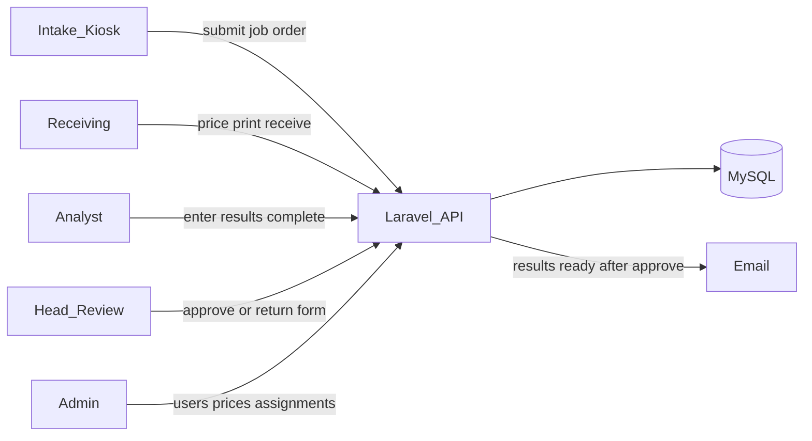
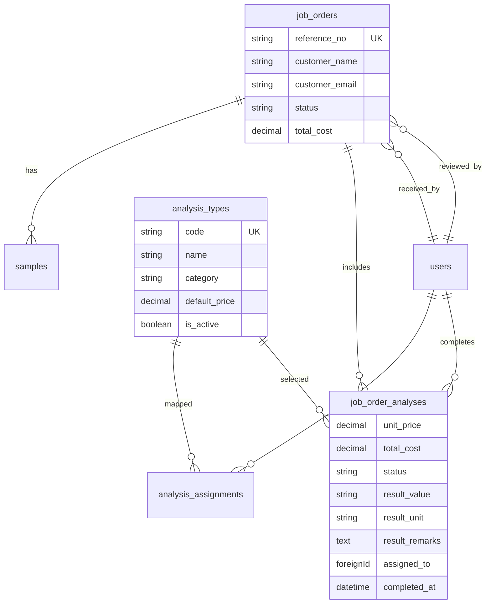

# NPPC Laboratory Management System

**Status:** Core v1 workflow is implemented. Remaining items are polish/ops (SMTP, optional PDF, optional realtime).

## Architecture (as built)

Single **Laravel** app with a **Vue 3 SPA** (Vite + [@nuxt/ui](https://github.com/nuxt/ui) Vue plugin) and REST under `/api`. Staff auth via **Laravel Sanctum** cookie sessions (login/logout/me on web middleware; domain APIs use `auth:sanctum`). **MySQL** (`nppc`).

Staff UI uses Nuxt UI **Dashboard** shell (`UDashboardGroup` / sidebar / navbar), inspired by the [Vue Dashboard template](https://dashboard-vue-template.nuxt.dev/), with brand colors from the NPPC logo (primary semantic color `nppc`, not default green).



**Roles**

- **Customer (kiosk):** No login. `/intake` landing → new or returning customer → guided wizard.
- **Receiving:** Price lines, print 2 copies of the official form, mark received (assigns analysts).
- **Analyst:** Enter **result** (required) + optional unit/remarks; complete assigned parameters.
- **Head Analysis:** Review the **Request for Analysis form with results**; approve (email) or return selected lines.
- **Admin:** Users, catalog prices, analyst↔procedure matrix.

## Project layout

```
NPPC/
  app/Enums, Models, Http/Controllers/Api, Services, Mail
  database/migrations, seeders
  resources/js/          # Vue SPA (pages, layouts, components, stores)
  resources/css/app.css  # NPPC theme tokens + surfaces
  routes/api.php, web.php
  public/nppc-logo.jpg
  tests/Feature, tests/Unit
```

## Domain model (as built)

Pricing lives on `job_order_analyses` (no separate billing_lines table). Results live on the same row.



**Status flow:** `draft_submitted` → `priced` → `in_analysis` (after receive) → `pending_review` → `ready_for_pickup`

- Analysts must save `result_value` to complete a line.
- When all lines are completed with results → `pending_review` (no email yet).
- Head **approve** → `ready_for_pickup` + `ResultsReadyMail` (if email on file).
- Head **return** clears results on selected lines → `in_analysis` / `returned`.

**Reference number:** `YY-XXXX` via `reference_counters` + `ReferenceNumberService`.

**Catalog (seeded to match paper form):** Microbiological (10), Physico-Chemical (30), Trace/Heavy Metals (16), Lime (3), plus free-text other tests.

## Workflow (current product)

1. Customer opens `/intake` → **New** or **Returning** (lookup by email/contact).
2. Guided wizard: details → samples → classification/field data → tests (categories as **dropdowns/accordions**) → review/submit.
3. Job created with default prices; status `draft_submitted`; reference shown.
4. Receiving: queue, edit prices, print `/receiving/{id}/print` (shared `RequestForAnalysisForm`, 2 copies), mark received → assign analysts → `in_analysis`.
5. Analyst: poll ~15s + popup; **Enter result** then complete.
6. All done → `pending_review`; Head opens same official form **with results**, approve or return.
7. Email: pickup notice with reference (no COA attachment in v1).

## API surface (as built)

| Area | Endpoints |
|------|-----------|
| Auth | `POST /api/login`, `POST /api/logout`, `GET /api/me` |
| Dashboard | `GET /api/dashboard/summary` (auth) |
| Catalog | `GET /api/analysis-types` (public) |
| Intake | `POST /api/intake/lookup`, `POST /api/intake/job-orders` (public, throttled) |
| Receiving | `GET/PATCH/POST` under `/api/receiving/job-orders...` |
| Analyst | `GET /api/analyst/tasks`, `POST /api/analyst/tasks/{id}/complete` (requires result) |
| Head | `GET /api/reviews`, `GET /api/reviews/{id}`, `POST .../approve`, `POST .../return` |
| Admin | `/api/admin/users`, `/api/admin/analysis-types`, `/api/admin/assignments` |

Role middleware: `role:receiving,admin`, `role:analyst,admin`, `role:head_analysis,admin`, `role:admin`.

## Frontend routes

| Path | Purpose |
|------|---------|
| `/intake` | Customer landing + wizard + success |
| `/login` | Staff sign-in (branded) |
| `/` | Home KPIs + workspace modules |
| `/receiving` | Queue + pricing + receive |
| `/receiving/{id}/print` | A4 print (2 dialogs) |
| `/analyst` | Tasks + result modal |
| `/head` | Official form review + approve/return |
| `/admin` | Users / prices / assignments |

Shared component: `resources/js/components/RequestForAnalysisForm.vue` (print + head review).

## Brand / UI

- Logo-based blues: `#1A3694` / `#365BB0` / `#5282D3` as `--color-nppc-*`
- Nuxt UI `ui.colors.primary = 'nppc'` (must use `ui: { colors: ... }` in Vite plugin, not only `theme.colors`)
- Font: Manrope
- Staff: collapsible dashboard sidebar

## Seed accounts

Password for all: `password`

| Role | Email |
|------|-------|
| Admin | `admin@nppc.local` |
| Receiving | `receiving@nppc.local` |
| Analyst | `analyst@nppc.local` |
| Head Analysis | `head@nppc.local` |

Document control on form: `NPPC-ADL LIF 7.1 F01`, Rev. 10, Effective 01/02/2024.

## Done (v1 core)

1. Scaffold + Sanctum + roles  
2. Schema, catalog seed, reference numbers  
3. Intake (landing, returning lookup, wizard, accordion categories)  
4. Receiving (price, print form, receive, assign)  
5. Analyst results + notifications  
6. Head review of official form + email on approve  
7. Admin users/prices/assignments  
8. Dashboard UI + NPPC theme  

## Next / optional

- Production SMTP + `queue:work` for mail  
- DomPDF (or similar) archival PDF  
- WebSockets instead of 15s polling  
- Full digital COA / result PDF attachment  
- Payments beyond form billing  
- Remote customer accounts (out of original scope)

## Out of scope (unchanged)

- Home online submission without visiting the lab (kiosk-at-office remains the model)
- Full LIMS instrument integration
