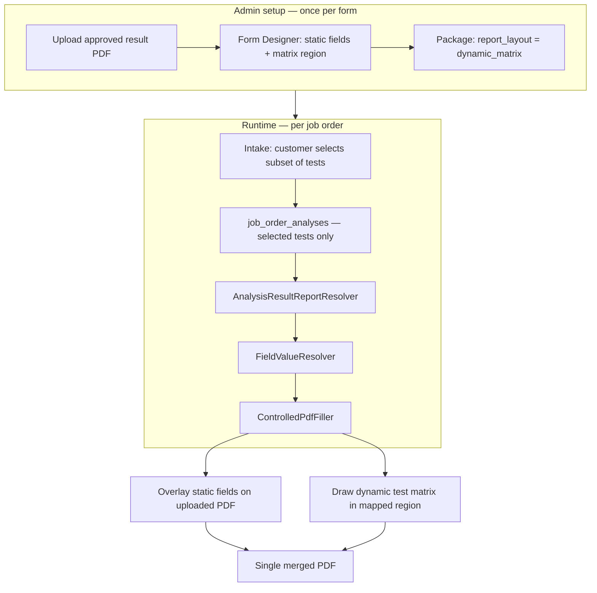

# Dynamic Controlled Forms

## System function

**Dynamic Controlled Forms** is one extension of the existing Controlled Forms module. It adds a **dynamic test matrix** to an uploaded, designer-mapped PDF so laboratory result reports can print **only the tests the customer selected** — without dashes, blank rows, or a second report engine.

Everything else stays the same: upload the approved PDF, map static fields in Form Designer, activate the revision, bind it to a package, preview, and print through the normal controlled-form pipeline.

| Standard controlled form | Dynamic controlled form |
|--------------------------|-------------------------|
| Fixed overlay slots (`test_1_*` … `test_N_*`) | One **Dynamic test matrix** region |
| Waived package tests print as `-` | Waived tests **do not appear** |
| Used for water microbiology (FO4, FO5) | Used for Food / Special Analysis, DW Physico package (FO37), and types-only DW Issue 11 OLD (FO3) |
| Package `report_layout = controlled_form` | Package `report_layout = dynamic_matrix`, or types-only form with a matrix field |

This is **not** a separate report system. It is the same Controlled Forms function with one additional field type and one additional PDF render step.

---

## Problem it solves

A package may list eight catalog tests, but intake may record only four. A template with eight pre-drawn table lines cannot remove unused rows using text overlays alone.

**Dynamic Controlled Forms** solves this by:

1. Keeping the official PDF shell (letterhead, customer block, dates, signatures).
2. Rendering the test table at runtime with **N rows = N selected analyses**.

Work lines and printed rows stay aligned: if the customer ordered four tests, the lab works four lines and the report shows four rows.

---

## Scope

### In scope

- Food Analysis and Special Analysis result sheets (multi-test matrix layout).
- Drinking Water Physico-Chemical package (`LSP-7.8-FO37` / `PKG-DW-PHYSICO`) with Method + Acceptable Values columns.
- Drinking Water Physico-Chemical Issue 11 OLD individual (`LSP-7.8-FO3`, types-only): any subset of bound DW tests; Method + Acceptable Values from Procedures.
- Admin setup through Controlled Forms + Packages (same screens as today).
- Form Designer field type: **Dynamic test matrix**.
- Per-cell and per-column styling in the designer (headers, sublabels, fonts, alignment).
- Preview and print through existing analyst / head / admin PDF endpoints.

### Out of scope (unchanged)

- Water microbiology FO4/FO5 fixed-slot reports (including drinking-water **micro** FO5).
- Replacing the uploaded PDF with a Blade/HTML template in production.
- A parallel admin workflow or separate print URL for matrix reports.

---

## Architecture



### Report paths

| Package `report_layout` | Form requirement | Test rows on PDF |
|-------------------------|------------------|------------------|
| `controlled_form` (default) | Any Analysis Result form with fixed slots | Fixed slots; waived → `-` |
| `dynamic_matrix` | Bound form must include **Dynamic test matrix** field | One row per selected analysis only |

If a `dynamic_matrix` package is bound to a form **without** a matrix region, the report is **unavailable** until an admin adds the field.

---

## Admin setup workflow

### 1. Controlled Forms — upload and design

1. **Admin → Controlled Forms** — create or open the Analysis Result form.
2. Upload the official Food/Special result PDF (Word → PDF conversion supported).
3. Open **Form Designer**.
4. Map static fields as usual:
   - customer name, address, specimen details
   - reference / control numbers, dates
   - **Analyzed by** → `results.analyst_name` (optional second analyst → `results.analyst_name_2`; PRC-only lines → `results.analyst_prc` / `results.analyst_prc_2`)
   - The **analyst** must enter name/PRC when clicking **Send to Head** (stored on the job as `result_signatories`). The analyst queue shows **Send to Head** as the primary action when the job is ready. Head reviews/releases only and cannot edit those fields. Analyst may edit name/PRC later when printing after release.
   - **Approved by** → `job_orders.reviewed_by_name`
   - report / release dates → `results.report_date`, `results.release_date`
5. Draw **one rectangle** over the test table body and set field type to **Dynamic test matrix**.
6. Configure the matrix (see [Matrix region configuration](#matrix-region-configuration)).
7. If the official sheet has a **Test Methods / References** (or similar) block under the table, map a **Multiline** field to **`results.test_methods_references`**. Prefer a blank methods area on the PDF; use `options.cover` only to blank obsolete printed methods ink. Runtime text is one line per selected test (`{name} — {method}`) using the same method resolution as nested matrix rows (`result_method` → Procedures → catalog). Waived/unchecked tests are omitted.
8. Save fields and **activate** the revision.

**Template tip:** If the uploaded PDF already prints column headers (`TEST`, `Result`, etc.), turn off **Show column headers** on the matrix field and position the region over the **body rows only**. Otherwise headers will appear twice.

### 2. Procedures — analysis catalog

1. Ensure analysis types exist for every test the package can include (% Fat, % Protein, etc.).
2. Set **Method** on each type in **Admin → Procedures** (`analysis_types.method`). That text prints under the test name on the matrix PDF **and** in the `results.test_methods_references` footer when mapped.
3. Proximate codes `PX-01`…`PX-08` are seeded with official methods; other types start blank until an admin fills them.

**Proximate filter tip:** Procedures live under category slug `proximate_analysis` (“Proximate Analysis”). Legacy duplicate categories (e.g. empty slug `proximate`) are deleted after any leftover types are moved. Edit Method from the procedure row modal, not from Form Designer cell text (designer edits are layout preview only).

To add a new test with a method: create the analysis type → set Method → attach it as a package member → it appears in Form Designer preview (when the form is bound to that package) and on the PDF when selected at intake.

### 3. Packages — bind form and layout

1. **Admin → Packages** — create or edit any package that should use a variable-row result table (not only proximate).
2. Attach all catalog analysis types in **print order**.
3. Set **Report layout** to **Dynamic matrix** (“Variable-row result table; unchecked kiosk members are omitted from the PDF”).
4. Bind the active Analysis Result controlled form revision. That form must include a **Dynamic test matrix** region in Form Designer.

### 4. Intake — customer selection

At intake, staff choose the package and check **only** the tests the customer wants. The system creates `job_order_analyses` for selected tests and records waived types separately.

| Package layout | Unchecked / waived tests on the result PDF |
|----------------|--------------------------------------------|
| `dynamic_matrix` | **Omitted** — not printed as rows |
| `controlled_form` (FO4/FO5 fixed slots) | Printed as `-` |

---

## Matrix region configuration

The matrix is one designer field (`field_type = dynamic_test_matrix`) stored on `controlled_form_fields` with JSON `table_config`.

### Columns

Default layout matches the NPPC Laboratory Test Results sheet:

| Column key | Typical label | Notes |
|------------|---------------|--------|
| `test` | TEST | Test name + method (two lines in one cell) |
| `sample_1` | Sample 1 | Optional sublabel, e.g. `SS: 18g` |
| `sample_2` | Sample 2 | Optional sublabel |

Columns can be renamed or reconfigured (e.g. `result`, `remarks`) per form.

For food sheets (Proximate, Milk, FO26, FO27), the result column header can pull live JO values via:

- `label_data_source` → e.g. `results.control_no` (prints the JO control number)
- `sublabel_data_source` → e.g. `results.sample_description` (prints the first sample description)

Static `label` / `sublabel` remain designer fallbacks when those bag values are empty.

### Table properties (properties panel)

| Property | Purpose |
|----------|---------|
| Body font size | Default text size for data cells |
| Header font size | Column header labels |
| Method font size | Second line in TEST column |
| Body row height (mm) | Minimum height per data row; auto-expands when method text wraps |
| Header row height (mm) | Minimum header band; auto-expands when sublabels are present |
| Matrix field box height | Designer selection rectangle; Preview/Download **stretch** drawn body rows to fill this box (no empty waived slots). Resize the blue box so the bottom edge sits where you want above NOTES. |
| Show column headers | Draw header row inside the matrix region |
| Draw cell borders | Table grid lines |
| Bold header labels | Header typography |
| Bold test names | TEST column name line |
| Preview rows in designer | How many package-member (or fallback sample) rows show on the canvas |

### Designer preview

Form Designer does **not** invent catalog tests. When the controlled form has an `analysis_package_id`, the matrix canvas previews that package’s members and their Methods. Without a bound package, proximate sample rows are used as layout placeholders. Inline cell edits remain layout-only; runtime rows come from selected `job_order_analyses`, and methods from `analysis_types.method` (with a catalog fallback for legacy PX codes).

### Word-style cell editing

In Form Designer, click a header or body cell to select it; double-click to edit inline. Use the **⋮⋮ drag** strip at the top of the matrix to move the whole region. Cell-level changes update `table_config` preview overrides only.

---

## Runtime behavior

### Value resolution

`FieldValueResolver` builds matrix row data from ordered selected analyses:

```text
test        ← analysis line name
test_method ← analysis_types.method (fallback: OfficialAnalysisCatalog::methodForCode)
result      ← result value + unit
sample_1    ← same as result (single-sample forms)
remarks     ← result remarks when present
```

For matrix forms, fixed-slot keys (`test_1_result`, etc.) are **not** filled with dashes for waived tests.

### PDF generation

`ControlledPdfFiller`:

1. Imports the canonical PDF page(s).
2. Writes static overlay fields (text, dates, checkboxes, signatures).
3. Calls `writeDynamicTestMatrix` for the matrix field:
   - measures header height from labels + sublabels
   - measures each body row from test name + method text
   - draws borders, headers, and cell content with TCPDF
   - **only selected analysis lines** become rows (no empty padding for unselected package members)

Output is a single PDF stream from `ControlledDocumentGenerator` — same entry point as all other controlled forms.

### Preview and print

Matrix reports use the **same URLs and authorization** as combined controlled-form result reports. Preview without a job order uses package-member (or sample) matrix rows. Preview with a job order uses live completed results when available.

Eligibility: all **selected** analysis lines must be completed before combined/matrix preview (same rule as today).

---

## Data model summary

| Layer | Item | Role |
|-------|------|------|
| Package | `analysis_packages.report_layout` | `controlled_form` or `dynamic_matrix` |
| Analysis type | `analysis_types.method` | Method line under test name on matrix PDF |
| Form field | `controlled_form_fields.field_type` | `dynamic_test_matrix` |
| Form field | `controlled_form_fields.table_config` | Columns, heights, typography, designer preview |
| Job | `job_order_analyses` | One row source per selected test |
| Job | `waived_type_ids` | Ignored by matrix renderer |
| Job | `result_signatories` | Analyst name(s) + optional PRC entered at Send to Head |
| Form | `analyst_signatory_slots` / `analyst_require_prc` | 1–4 analysts; PRC required or not. FO2 uses 4 labeled slots (Reviewed / Noted / Certified ×2). |

---

## Comparison with fixed-slot controlled forms

| Concern | Fixed-slot (`controlled_form`) | Dynamic (`dynamic_matrix`) |
|---------|-------------------------------|----------------------------|
| Designer field types | Text, date, checkbox, table, etc. | Same + **Dynamic test matrix** |
| Row count on PDF | Fixed by template slots | Matches selected tests |
| Waived tests | Print `-` in slot | Omitted |
| Package binding | Required | Required |
| PDF engine | FPDI + TCPDF overlay | Same |
| FO4 / FO5 water reports | Yes | No change |

---

## Related code

| Area | File |
|------|------|
| Package layout enum | `app/Enums/AnalysisPackageReportLayout.php` |
| Matrix field type | `app/Enums/ControlledFormFieldType.php` |
| Row building / ordering | `app/Support/DynamicTestMatrix.php` |
| Value resolution | `app/Services/FieldValueResolver.php` |
| Report routing | `app/Services/AnalysisResultReportResolver.php` |
| PDF fill + matrix render | `app/Services/ControlledPdfFiller.php` |
| Document generation | `app/Services/ControlledDocumentGenerator.php` |
| Form Designer page | `resources/js/pages/admin/form-designer.tsx` |
| Matrix preview component | `resources/js/components/form-designer/dynamic-test-matrix-preview.tsx` |
| Matrix config / types | `resources/js/lib/dynamic-test-matrix.ts` |
| Packages admin UI | `resources/js/pages/admin/packages.tsx` |
| Feature tests | `tests/Feature/DynamicTestMatrixReportTest.php` |

---

## Related documentation

| Document | Contents |
|----------|----------|
| `docs/CONTROLLED_FORMS.md` | Full Controlled Forms module (designer, storage, filler) |
| `docs/CONTROLLED_FORMS_NON_TECHNICAL.md` | Staff-facing controlled forms guide |
| `docs/DYNAMIC_FOOD_ANALYSIS_RESULT_PDF.md` | Original feature specification |
| `docs/DYNAMIC_FOOD_ANALYSIS_IMPLEMENTATION_PLAN.md` | Phase-by-phase implementation checklist |

---

## Quick reference

| Question | Answer |
|----------|--------|
| Is this a new report system? | **No** — one function on top of Controlled Forms. |
| What is new? | **Dynamic test matrix** field + matrix render step + package `report_layout` flag. |
| How do only four tests print? | Intake selects four → four `job_order_analyses` → matrix draws four rows. |
| Can signatures and headers use the same sources as FO4/FO5? | **Yes** — same field catalog in Form Designer. |
| Do water packages change? | **No** — they keep `controlled_form` and fixed slots. |
| What if the template already has table headers? | Disable **Show column headers** on the matrix field. |
