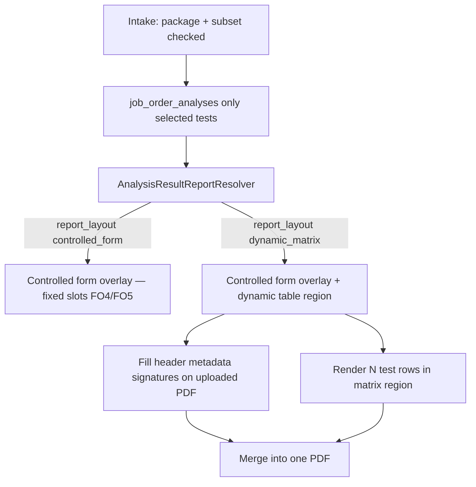

# Dynamic Food / Special Analysis Results PDF

## Goal

When a **package** defines 8 catalog tests but the **customer selects only 4**, the printed laboratory result report must show **exactly 4 table rows** — not 8 rows with dashes for unused tests.

This applies to **Food Analysis** and **Special Analysis** style reports (multi-test matrix layout like the NPPC Laboratory Test Results sheet).

Existing **water microbiology** reports (FO4, FO5, controlled-form overlay) stay unchanged.

---

## Core idea: extend controlled forms, not replace them

Food/Special Analysis uses the **same controlled-form workflow admins already know**:

1. Upload the approved PDF (or Word → PDF).
2. Open **Form Designer** and map fields (customer, dates, ref no., signatures, etc.).
3. Activate the revision and bind it to the package.

The **only new capability** on top of the current design form is a **dynamic table region** — one special field type that renders N rows from selected `job_order_analyses` instead of fixed overlay slots.

| Part of report | Today (water FO4/FO5) | Food / Special (new) |
|----------------|----------------------|----------------------|
| Upload PDF + designer | Yes | **Same** |
| Header, customer block, dates | Mapped text/date fields | **Same** |
| Analyzed by / Approved by | `results.analyst_name` (+ optional `results.analyst_name_2` / PRC keys), `job_orders.reviewed_by_name`, report dates | **Same** — Analyzed by is entered by the analyst at Send to Head (editable by analyst at print); Head fills Approved by on release |
| Test result rows | Fixed slots (`test_1_*` … `test_N_*`); waived → `-` | **Dynamic table** — one row per selected test only |

So technically this is **not a second report system**. It is the existing controlled-form pipeline plus one new render mode for the test table.

---

## Problem with fixed slots only

A Word or PDF template with **8 pre-drawn table lines** cannot remove unused rows using field overlays alone. Unchecked tests today print as `-` in fixed slots (`FieldValueResolver::fillResultTestSlots`).

For Food/Special Analysis the client requirement is:

- **Work lines:** only selected tests are ordered and analyzed (already true at intake).
- **Printed report:** only selected tests appear as rows (new behavior).

**Solution:** keep the controlled-form shell; inject a **dynamic table** in a designer-defined region where row count = number of selected analyses.

---

## Architecture

| Path | When | Output |
|------|------|--------|
| `controlled_form` | Default; water micro packages | Active controlled form PDF + field overlay; waived slots show `-` |
| `dynamic_matrix` | Food / Special Analysis packages | Same controlled form PDF + overlays for static fields; **dynamic table** for test rows |

---

## Design

### 1. Package report layout flag

Add to `analysis_packages`:

| Column | Values | Default |
|--------|--------|---------|
| `report_layout` | `controlled_form` \| `dynamic_matrix` | `controlled_form` |

**Admin → Packages:** choose result report layout and bind the active Analysis Result controlled form (same as today).

Food / Special Analysis package → `dynamic_matrix` + bound form. Water packages → `controlled_form`.

### 2. Form Designer: dynamic table field (the new function)

**This is the main new UI/engine feature.**

Add a field type to the existing Form Designer, e.g. `dynamic_test_matrix`:

- Admin uploads the official Food/Special PDF (table body may be blank or omitted on the source file).
- Admin maps all static fields as today (customer, address, specimen, dates, ref no., notes block if needed).
- Admin maps **Analyzed by** → `results.analyst_name`, **Approved by** → `job_orders.reviewed_by_name`, dates → `results.report_date` / `results.release_date` (same catalog as FO4/FO5).
- Per result form, admin can set **1 or 2 analyst slots** and whether **PRC ID is required**. The **analyst** enters those values at **Send to Head**; they persist on the job for reprints. Head cannot edit them. Analysts may adjust them when printing after release.
- Admin draws **one rectangle** where the test table should appear and sets type = **Dynamic test matrix**.

**Matrix region properties (v1):**

| Property | Purpose |
|----------|---------|
| Position / size (mm) | Where to render the table on the page (same coordinate system as other fields) |
| Columns | e.g. TEST (name + method), Result, Remarks |
| Row source | Selected `job_order_analyses` for the job, ordered by package member slot |
| Header row | Optional styled column headers inside the region |

**What the designer does *not* do:** pre-draw 8 fixed test rows. That is the whole point — row count is runtime.

Persist the region like other fields on `controlled_form_fields` (new `field_type` + JSON config for columns).

### 3. PDF render pipeline

**Extend existing services** (do not fork a parallel admin flow):

| Step | Service | Behavior |
|------|---------|----------|
| Resolve form + fields | `AnalysisResultReportResolver`, `ControlledFormService` | Package with `dynamic_matrix` still resolves bound Analysis Result form |
| Resolve values | `FieldValueResolver` | Same header/signature keys; **skip** `fillResultTestSlots` dash fill for matrix forms |
| Fill static overlays | `ControlledPdfFiller` | Text, dates, signatures on uploaded PDF — unchanged |
| Fill dynamic table | **New:** matrix renderer (DomPDF fragment or TCPDF table in region) | N rows = N selected analyses |
| Output | `ControlledDocumentGenerator` | Single merged PDF stream |

The matrix renderer can use DomPDF/HTML internally for row layout; that is an implementation detail hidden behind the controlled-form print path.

### 4. Resolver branch

**File:** `app/Services/AnalysisResultReportResolver.php`

When the job’s package has `report_layout = dynamic_matrix`:

- Require the bound Analysis Result controlled form (same as combined reports today).
- Return report kind e.g. `KIND_MATRIX` (or `KIND_COMBINED` with `renderer: matrix`).
- `analyses` = only existing `job_order_analyses` (already limited to customer selection).
- Preview eligibility: all selected lines completed (same rule as combined reports).

When `report_layout = controlled_form`, keep current package → controlled form → fixed-slot overlay behavior.

### 5. Preview and print wiring

**Files:** `app/Http/Controllers/AnalystController.php`, `app/Http/Controllers/ReviewController.php`

Matrix reports use the **same preview/print URLs** as combined controlled-form reports (not a separate “DomPDF-only” endpoint). Authorization unchanged.

### 6. Admin setup workflow

1. **Admin → Controlled Forms:** upload Food/Special Analysis result PDF; map static fields + signature lines; add **Dynamic test matrix** region; activate revision.
2. **Admin → Procedures:** ensure analysis types exist (% Fat, % Protein, etc.) with methods where known.
3. **Admin → Packages:** create Food / Special Analysis package, bind the form, set `report_layout = dynamic_matrix`, define all catalog members in print order.
4. **Intake:** choose package; check only tests the customer wants.

### 7. Tests

- Package with 8 members, job with 4 selected → PDF contains **4** test rows; waived types absent entirely.
- Header, customer, analyst name, approved name still come from controlled-form overlays.
- Water micro package still resolves to fixed-slot controlled form path (dashes for waived).
- Matrix PDF endpoint returns 200 when all selected lines are completed.

---

## What stays the same vs what is new

| Area | Change? |
|------|---------|
| Upload PDF, revisions, activate | No |
| Form Designer for text/date/signature fields | No |
| Field value catalog (`results.*`, `job_orders.reviewed_by_name`, etc.) | No |
| Package → form binding | No |
| FO4/FO5 fixed test slots + `-` for waived | No |
| **Dynamic test matrix field in designer** | **Yes — new** |
| **Matrix render step in PDF filler** | **Yes — new** |
| **`report_layout` flag on package** | **Yes — new** |
| Skip fixed-slot dash fill when matrix | **Yes — new** |

---

## Explicit non-goals (this iteration)

- Changing FO4/FO5 fixed-slot fill behavior (dashes for waived package slots).
- Per-sample result columns unless the data model already supports them.
- Rebuilding letterhead in Blade when a controlled-form PDF is bound (use the uploaded template).

---

## Fallback without uploaded PDF (dev only)

If no controlled form is bound yet, a temporary standalone DomPDF Blade view (`analysis-result-matrix.blade.php`) can be used for development and tests. **Production target** is always: uploaded PDF + designer + dynamic table region. Remove or gate the fallback once the official template is uploaded.

---

## Implementation order

1. Migration + `report_layout` on `analysis_packages` + Packages admin UI
2. Designer: `dynamic_test_matrix` field type + persistence + properties panel
3. `FieldValueResolver`: matrix mode — omit fixed-slot dash fill
4. Matrix renderer + integrate into `ControlledPdfFiller` / `ControlledDocumentGenerator`
5. `AnalysisResultReportResolver` branch + Analyst / Head preview wiring
6. Seed or document Food/Special package + form; feature tests (4 of 8 → 4 rows)

---

## Related code (today)

| Area | File |
|------|------|
| Package → form binding | `app/Services/ControlledFormService.php` |
| Report resolution | `app/Services/AnalysisResultReportResolver.php` |
| Overlay slot fill (dashes) | `app/Services/FieldValueResolver.php` |
| PDF fill + merge | `ControlledPdfFiller`, `ControlledDocumentGenerator` |
| Form Designer UI | `resources/js/pages/admin/form-designer.tsx` |
| Field catalog | `config/controlled_form_sources.php` |
| Intake selection | `app/Services/JobOrderService.php` (`selected_type_ids`, `waived_type_ids`) |
| Controlled forms docs | `docs/CONTROLLED_FORMS.md` |

---

## Summary

| Question | Answer |
|----------|--------|
| Is this a whole new report system? | **No** — same controlled-form upload, designer, and field mapping. |
| What is actually new? | **One function:** a **dynamic test matrix** region in Form Designer + render step in the PDF filler. |
| How does the customer get only 4 tests in the lab? | Intake checks 4 of 8 → only 4 `job_order_analyses` (already works). |
| How do only 4 appear on the printed report? | Matrix region renders 4 rows; static header/signatures still use controlled-form overlays. |
| Can I map Analyzed by / Approved by like FO4/FO5? | **Yes** — same data sources in the designer. |
| Do water packages change? | **No** — they keep fixed-slot controlled-form reports. |

> **Consolidated system doc:** `docs/DYNAMIC_CONTROLLED_FORMS.md`
